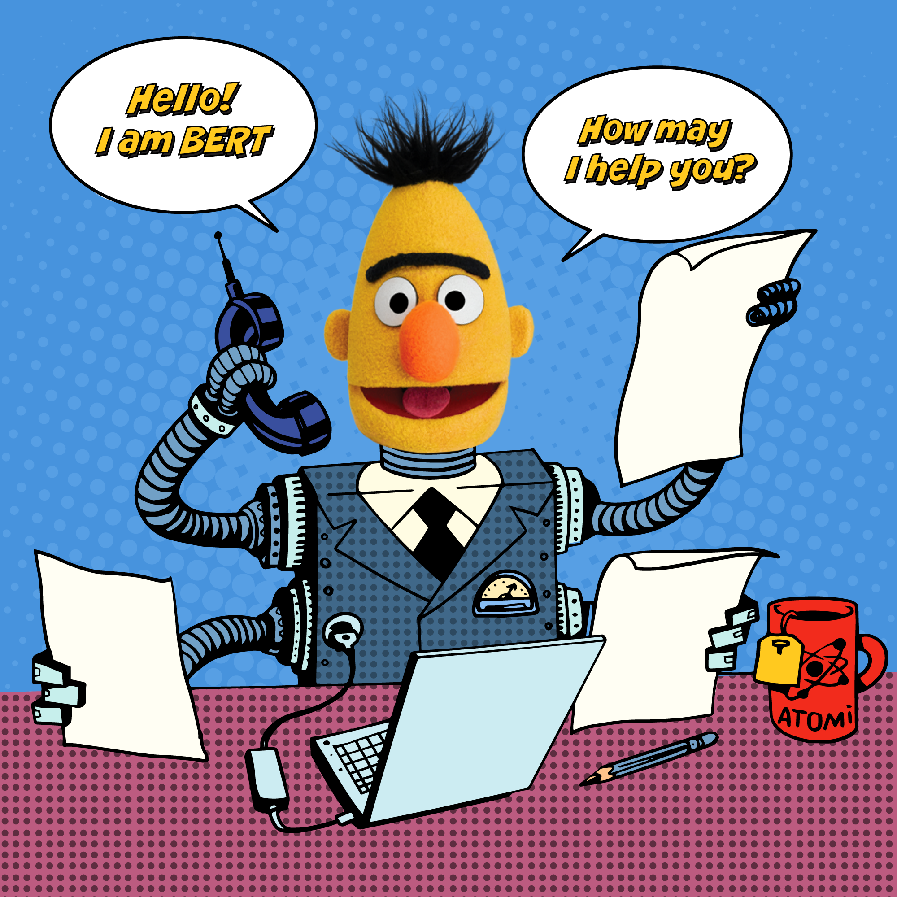

# Laborde_Guerin_Tanda_LADS

Dans ce repository il y a un dossier pour la partie Sequence Classification et un ipynb.

### Guerin_Laborde_colab.ipynb

Le premier "Guerin_Laborde_colab.ipynb" est le code comportant des illustrations de différentes étapes et techniques de l'utilisation de TANDA.

### Sequence Classification

Ce dossier contient tous les éléments nécessaires pour l'exécution du fichier ipynb. Le code "Rendu_DEFIIA_GUERIN_LABORDE.ipynb" est un code destiné au defi-ia mis en place dans la matière PDM(Projet données massives) qui porte sur de la classification de phrases. L'objectif de ce défi était de prédire le métier correspondant à une description. Plusieurs méthodes de prédiction sont utilisées dont BERT et ROBERTA qui donnent les meilleurs résultats.

